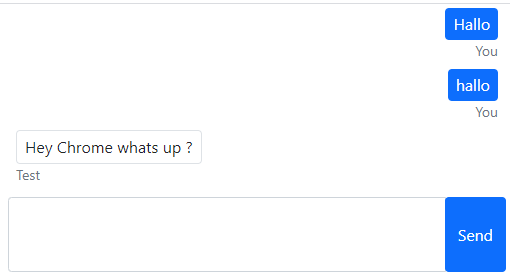

# FFoPS PoC - FireFighting Operations Management App

This is a proof of concept. It shows a Micro frontend app consisting of 3 parts.

- a Chat component
- operations management component
- an app shell

## Use Case

As voluntary firefighter

## Chat component

The Chat App is build with a quarkus backend und a React Frontend

The app has no remotes.

## operations management component (Alerting)
